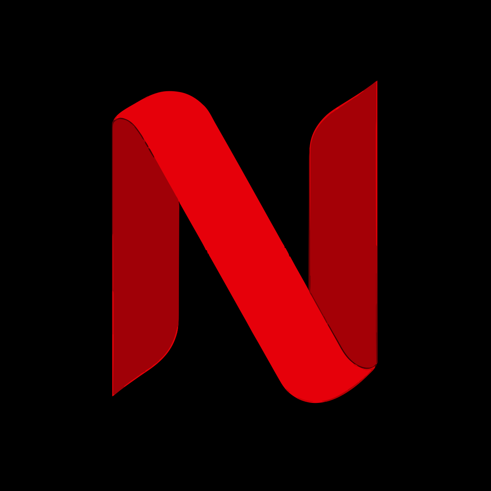
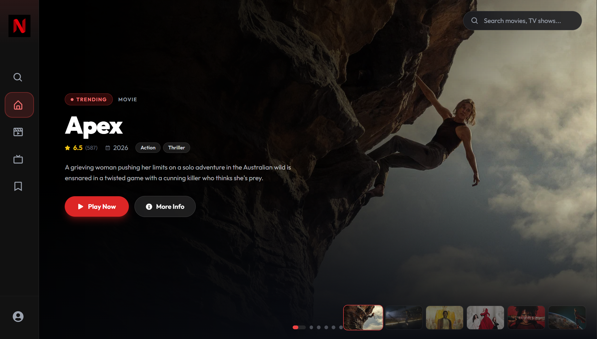
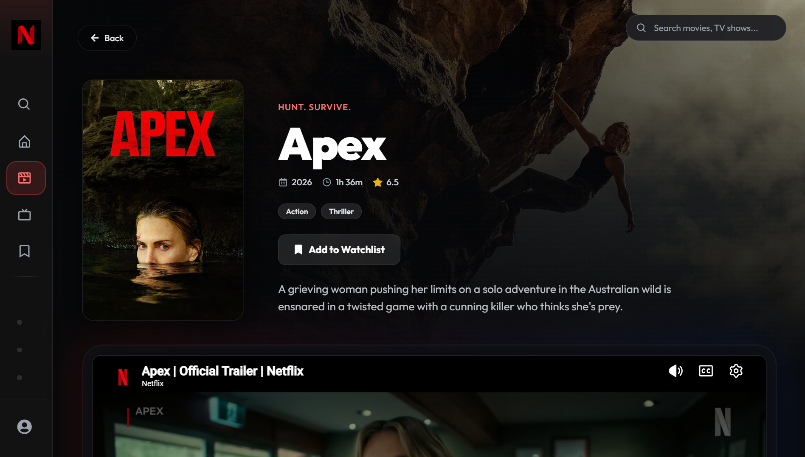
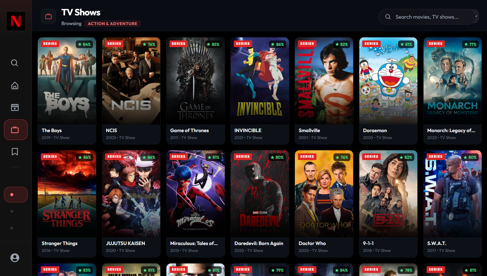

<div align="center">
  
  <h1>Netflix Clone</h1>
  <p><strong>A Modern, High-Performance Streaming Platform Clone</strong></p>

  <p>
    <a href="https://react.dev/"></a>
    <a href="https://vitejs.dev/"></a>
    <a href="https://tailwindcss.com/"></a>
    <a href="https://firebase.google.com/"></a>
  </p>
</div>

---

## 🌟 Overview

This **Netflix Clone** is a premium, beautifully designed movie and TV show discovery web application built to showcase modern frontend development skills. Developed with **React 18**, **Vite**, and **Tailwind CSS**, it features a pixel-perfect dark UI inspired by leading streaming platforms. The app fetches real-time data from the TMDB API, allowing users to browse trending content, search dynamically, save favorites to a cloud-synced Watchlist, and view official YouTube trailers directly within the platform.

<div align="center">
  
  <br/><br/>
  <div style="display: flex; justify-content: space-between; gap: 10px;">
    
    
  </div>
</div>

---

## ✨ Key Features

### 🎬 Trailer Playback & Details
- **Official Trailers**: Integrated with the TMDB API and YouTube to seamlessly stream high-quality official trailers within a cinematic embedded player.
- **Dynamic Routing & Data**: Comprehensive details for movies and TV shows including cast, crew, runtime, and related recommendations.
- **TV Seasons & Episodes**: Interactive episode selector for TV shows with thumbnails and synopses.

### 🔍 Discovery & Navigation
- **Global Search Bar**: Instant, glassmorphism search bar available on every page for fluid user discovery.
- **Trending & Personalization**: Homepage defaults to weekly trending content, with specialized genre filtering.
- **Infinite Scrolling**: Smooth, seamless pagination as you scroll through infinite content grids.

### 🔐 User Accounts & Cloud Sync
- **Firebase Authentication**: Secure Google OAuth and Email/Password login flows.
- **Cloud Watchlist**: Add movies and TV shows to a personal Watchlist synced instantly across devices using Cloud Firestore.

### 📱 Premium UI / UX
- **Pixel-Perfect Dark Mode**: A sleek, premium dark theme utilizing advanced CSS concepts like subtle gradients and glassmorphism (blur) effects.
- **Responsive Design**: A flawless, adaptive experience across Desktop, Tablet, and Mobile devices.
- **Performance Optimized**: Built with Vite for rapid HMR and optimized production bundling.

---

## 🚀 Getting Started

### Prerequisites
- **Node.js** (v18 or higher)
- **TMDB API Key** ([Get one here](https://www.themoviedb.org/signup))
- **Firebase Project** (For Auth and Firestore)

### 1. Clone the Repository
```bash
git clone https://github.com/yahskamrahs/NetflixClone.git
cd Netflix-Clone
```

### 2. Install Dependencies
```bash
npm install
```

### 3. Environment Setup
Create a `.env` file in the root directory and add your configuration details. The app uses Vite, so variables must be prefixed with `VITE_`.

```env
# TMDB API
VITE_TMDB_API=your_tmdb_api_key
VITE_BASE_URL=https://api.themoviedb.org/3

# Security & App Links
VITE_ALLOWED_LINKS=https://discord.gg, https://twitter.com
VITE_PLAYSTORE_URL=https://play.google.com/store/apps/details?id=com.yourapp
VITE_APPSTORE_URL=https://apps.apple.com/us/app/yourapp/id123456

# Firebase Config (Auth & Firestore)
VITE_FIREBASE_API_KEY=your_api_key
VITE_FIREBASE_AUTH_DOMAIN=your_auth_domain
VITE_FIREBASE_PROJECT_ID=your_project_id
VITE_FIREBASE_STORAGE_BUCKET=your_storage_bucket
VITE_FIREBASE_MESSAGING_SENDER_ID=your_sender_id
VITE_FIREBASE_APP_ID=your_app_id
VITE_FIREBASE_MEASUREMENT_ID=your_measurement_id
```

> **Important**: Ensure that **Authentication** (Email/Password & Google) and **Firestore Database** are enabled in your Firebase console.

### 4. Run the Development Server
```bash
npm run dev
```
Open [http://localhost:5173](http://localhost:5173) to view it in your browser.

---

## 🏗️ Architecture & Tech Stack

- **Frontend**: React 18, Vite
- **Styling**: Tailwind CSS, Framer Motion (Animations)
- **Routing**: React Router DOM v6
- **Backend / BaaS**: Firebase (Auth, Firestore)
- **Icons**: React Icons (Boxicons, FontAwesome)
- **Data Source**: TMDB API

---

<div align="center">
  <p>Developed and Designed by <a href="https://akshaykumarsharma.in">Akshaykumar Sharma</a></p>
</div>
"# NetflixClone" 
